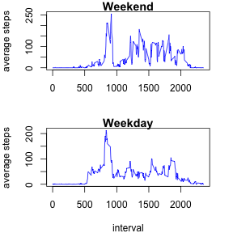

Reproducible Research - Assignment 1
========================================================

## Introduction
This assignment makes use of data from a personal activity monitoring device. This device collects data at 5 minute intervals through out the day. The data consists of two months of data from an anonymous individual collected during the months of October and November, 2012 and include the number of steps taken in 5 minute intervals each day.

## Data
- Dataset: [Activity monitoring data](https://d396qusza40orc.cloudfront.net/repdata%2Fdata%2Factivity.zip)

#### The variables included in this dataset are:
- steps: Number of steps taking in a 5-minute interval (missing values are coded as NA)
- date: The date on which the measurement was taken in YYYY-MM-DD format
- interval: Identifier for the 5-minute interval in which measurement was taken

## Loading and preprocessing the data
Preparing the environment and loading the downloaded data.

```r
setwd("~/Downloads/Data_Scientist")
library(data.table)
dt <- read.csv2("activity.csv", header = TRUE, sep = ",", as.is=TRUE)
```
Processing and transforming the date column to the right format.

```r
dt$date <- strptime(dt[,"date"], "%Y-%m-%d")
```

## What is mean total number of steps taken per day?
Histogram of the total number of steps taken each day:

```r
library(plyr)
cdata <- ddply(dt, "date", summarise, N = sum(steps))
mean = mean(cdata[, "N"], na.rm=TRUE)
median = median(cdata[, "N"], na.rm=TRUE)

hist(cdata[,"N"], main="Total Steps Distribution", xlab = "steps")
```

 

The **mean** and **median** total number of steps taken each day are:
- mean: 1.0766 &times; 10<sup>4</sup>
- median: 10765

## What is the average daily activity pattern?
Time series plot of the 5-minute interval and the average number of steps taken, averaged across all days:

```r
cdata2 <- ddply(dt, "interval", summarise, avg = mean(steps, na.rm=TRUE))
plot(cdata2[, "interval"], cdata2[, "avg"], type="l", xlab = "interval", ylab = "average steps", main = "Average steps by interval")
```

 

```r
max_avg <- max(cdata2[, "avg"])
max_interval <- cdata2[order(cdata2[,"avg"],decreasing=T)[1], "interval"]
```
The interval: 835 contains the maximum number of average steps of: 206.1698.

## Imputing missing values

```r
NA_total <- sum(is.na(dt[, "steps"]))
```
There are a couple of days/intervals where values are missing and this can introduce bias to the data analysis. Within the dataset, there are in total **2304 missing values** present.

A new dataset is created by eliminiating the missing values using the average total steps per interval as calcualted above. The average number is also rounded to the nearest integer.

```r
for(i in 1:length(dt[, "steps"])){
    if(is.na(dt[i, "steps"])){
        int <- dt[i, "interval"]
        dt$steps_new[i] <- round(cdata2[cdata2$interval == int, "avg"],0)
    } else{
        dt$steps_new[i] <- dt[i, "steps"]
    }
    next
}
cdata_new <- ddply(dt, "date", summarise, N = sum(steps_new))
```
Histogram of the total number of steps taken each day using the new dataset:

```r
hist(cdata_new[,"N"], main="Total Steps Distribution", xlab = "steps")
```

 
The table below summarises the differences in mean and median:

```r
mean_new = mean(cdata_new[, "N"])
median_new = median(cdata_new[, "N"])
## sum_data <- data.frame(c(mean, median), c(mean_new, median_new), row.names=c("mean", "median"))
## colnames(sum_data) <- c("Old data", "New data")
```
Row Names | Old Data | New Data
--------- | -------- | --------
Mean | 1.0766 &times; 10<sup>4</sup> | 1.0766 &times; 10<sup>4</sup>
Median | 10765 | 1.0762 &times; 10<sup>4</sup>

## Are there differences in activity patterns between weekdays and weekends?

```r
for(i in 1:length(dt[, "steps"])){
    if(as.POSIXlt(dt[i, "date"])$wday<6){
        dt$day[i] <- "weekday"
    } else{
        dt$day[i] <- "weekend"
    }
    next
}
dt$date <- as.character(dt$date)
cdata_wday <- ddply(dt, .(day, interval), summarize, avg = mean(steps_new))
```
Below is a panel plot of the 5-minute interval and the time series of average number of steps taken across all weekday days or weekend days.

```r
library(lattice)
cdata_wday <- transform(cdata_wday, day = factor(day))
xyplot(avg ~ interval | day, data = cdata_wday, layout = c(1,2), type = "l", xlab = "Interval", ylab = "Number of steps")
```

 
